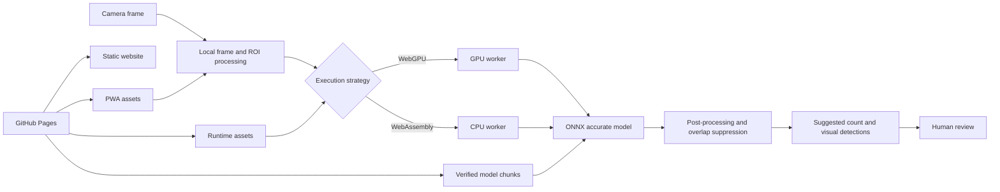
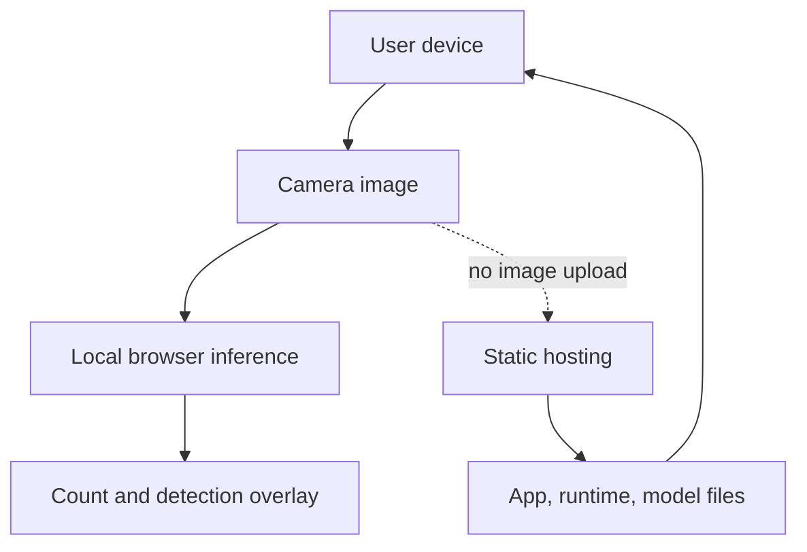
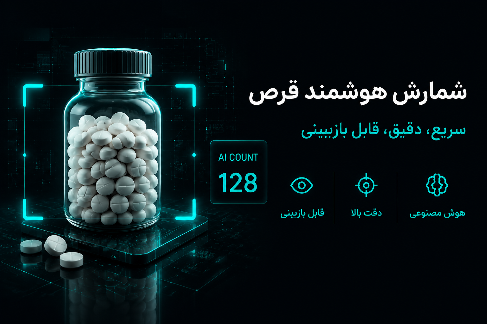
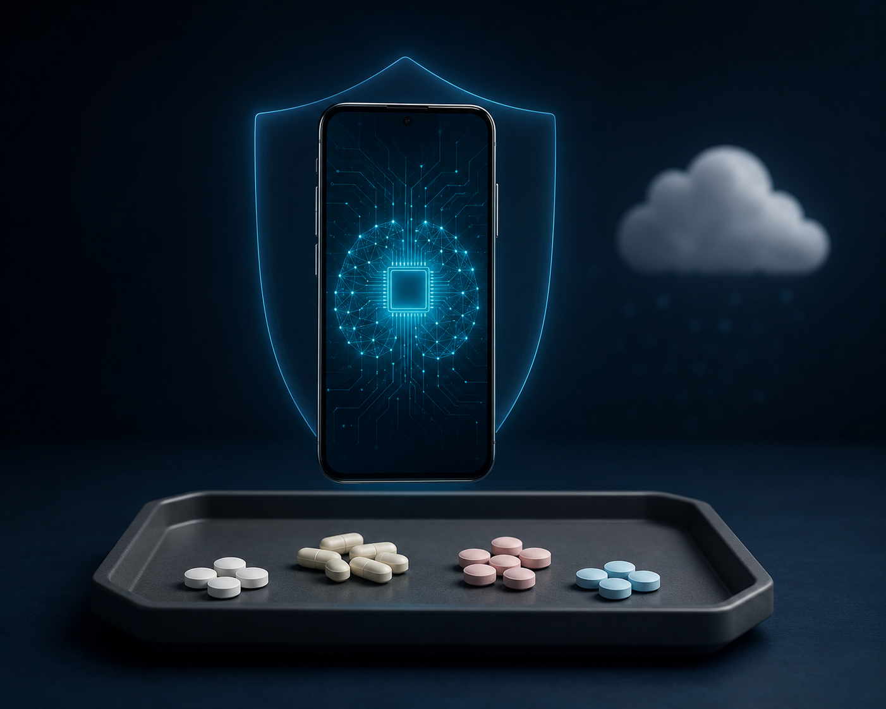

<p align="center">
  
</p>

<div align="center">
  <h1>BeshmarAI — Free, Private, On-Device AI Pill Counting</h1>

  <p>
    A bilingual, installable pill-counting web application for pharmacy teams,<br />
    caregivers, researchers, and anyone who needs a fast count that can still be visually reviewed.
  </p>

  <p>
    <a href="https://beshmarai.ir/"><strong>English website</strong></a>
    ·
    <a href="https://beshmarai.ir/fa/"><strong>وب‌سایت فارسی</strong></a>
    ·
    <a href="https://beshmarai.ir/app/"><strong>Open the app</strong></a>
    ·
    <a href="README.fa.md"><strong>README فارسی</strong></a>
  </p>

  <p>
    
    
    
    
    
    
  </p>
</div>
<p align="center">
  

  
</p>

> **BeshmarAI is an assistive counting tool.** It returns a suggested count and visual detections that must be reviewed by the responsible user. It does not identify medicines, validate dosage, prescribe treatment, or replace professional pharmacy procedures.

## Overview

BeshmarAI is a camera-based pill-counting system built around a simple principle: the image should remain on the user’s device whenever possible. The public edition is delivered as a static website and Progressive Web App. The browser downloads the application, ONNX Runtime assets, and verified model chunks, then performs inference locally through WebGPU or WebAssembly.

This repository contains a deliberately separated **public edition**. It includes the website, bilingual PWA, public model packaging, runtime selection logic, and GitHub Pages deployment workflow. It does not contain the private production backend, database, OTP infrastructure, payment services, administrative systems, production credentials, or the private repository history.

## Why BeshmarAI

Manual pill counting is repetitive, time-consuming, and vulnerable to distraction. BeshmarAI is designed to make that workflow faster without hiding the result behind an opaque number.

- **Fast visual counting** — capture the pills and request an accurate count.
- **Reviewable output** — detections are drawn over the result so the user can inspect what was counted.
- **On-device inference** — counting images are not uploaded to a remote inference server.
- **No account required** — the public edition has no login, phone verification, OTP, checkout, or subscription gate.
- **Bilingual interface** — English is the default; Persian is available in one tap and remembered on the device.
- **Adaptive execution** — users can select Automatic, GPU/WebGPU, or CPU/WebAssembly.
- **Installable PWA** — supported browsers can add the application to the home screen.
- **Offline-friendly repeat use** — after the required assets have been prepared and cached, later sessions can reuse local files where the browser permits it.

## Live destinations

| Destination | URL | Purpose |
|---|---|---|
| English website | [beshmarai.ir](https://beshmarai.ir/) | Product information, safety, articles, and project pages |
| Persian website | [beshmarai.ir/fa](https://beshmarai.ir/fa/) | Full Persian version of the public website |
| Pill-counting PWA | [beshmarai.ir/app](https://beshmarai.ir/app/) | Camera, accurate count, settings, and installation |
| Public repository | [BeshmarAI-Free](https://github.com/AliGhorbani1380/BeshmarAI-Free) | Source-visible public edition and deployment workflow |

## Typical counting workflow

1. Open the PWA over HTTPS and allow camera access.
2. Place the pills under even lighting and keep individual pills as visually separated as practical.
3. Select or adjust the counting region.
4. Press **Accurate Count**.
5. Wait while the selected local runtime processes the frozen image.
6. Inspect the visual detection markers and suggested count.
7. Correct the physical arrangement and repeat when overlap, glare, blur, or framing makes the result uncertain.
8. Confirm the final number through the responsible human workflow.

## Runtime strategy

The application exposes runtime preferences in **Settings** and stores the selected strategy on the device.

| Mode | Best for | Behaviour |
|---|---|---|
| **Automatic — recommended** | Most users | Measures the device once, selects a stable execution plan, and reuses it later |
| **GPU / WebGPU** | Compatible modern browsers and GPUs | Uses hardware acceleration; automatically falls back to the safe CPU route when required |
| **CPU / WebAssembly** | Broad compatibility and predictable fallback | Runs with 1, 2, or 4 threads where browser isolation and device support allow it |

The effective path depends on the browser, operating system, graphics implementation, available memory, secure-context support, and model compatibility. Choosing GPU does not guarantee that every operation will remain on the GPU; stability takes priority over a forced provider.

## Public model package

The public model package is split into GitHub-friendly chunks and verified against a SHA-256 manifest before use.

| Model | Purpose | Size | Package |
|---|---|---:|---|
| Preview model | Live guidance and fast visual feedback | 2,674,908 bytes | 1 verified chunk |
| Accurate model | Final reviewable count | 80,805,153 bytes | 4 verified chunks |

The first accurate-count preparation can therefore require an approximately 80 MB transfer. Keep the page open until preparation is complete. Later sessions can reuse cached model data when the browser’s storage policy allows it.

## Evaluation snapshot

The following figures are the project’s clean held-out test results for the final pill-counting model. They describe a controlled evaluation set and are **not** a guarantee for every camera, pill type, lighting condition, or operational environment.

| Metric | Result |
|---|---:|
| Test images | 1,482 |
| Mean absolute error (MAE) | 0.8023 |
| Exact-count accuracy | 80.09% |
| Within ±1 pill | 89.95% |
| Within ±2 pills | 93.32% |
| Within ±5 pills | 96.29% |
| Mean signed error | +0.3124 |

Real-world performance can be lower when pills overlap, objects are partially outside the frame, the surface reflects light, the camera is out of focus, the lens is dirty, or the device/browser cannot execute the preferred runtime reliably.

## Architecture



### Privacy boundary



## Product preview

<table>
  <tr>
    <td width="50%"></td>
    <td width="50%"></td>
  </tr>
  <tr>
    <td align="center"><strong>Focused mobile workflow</strong></td>
    <td align="center"><strong>Local model execution</strong></td>
  </tr>
</table>

## Technology stack

| Layer | Technology |
|---|---|
| Website | Next.js 16, React 19, static export |
| PWA | React 19, Vite 8, vite-plugin-pwa |
| Language | TypeScript 6 |
| Inference | ONNX Runtime Web 1.27 |
| Acceleration | WebGPU with WebAssembly fallback |
| Packaging | Verified model manifest and chunk assembly |
| Hosting | GitHub Pages with a custom domain and HTTPS |
| Automation | GitHub Actions |

## Repository layout

```text
.github/workflows/   GitHub Pages build and deployment
apps/site/           English-first Next.js website with Persian /fa routes
apps/web/            Bilingual Vite + React pill-counting PWA
apps/web/public/     Public assets, ONNX Runtime assets, and model chunks
scripts/             Public-boundary, model-package, and deployment assembly checks
docs/                README and repository presentation assets
SECURITY.md          Security and responsible reporting guidance
PRODUCTION_SOURCE.md Provenance of the public production-derived interface
```

## Run locally

### Requirements

- Node.js **20.9 or newer**; Node.js 22 LTS is recommended.
- npm compatible with the lockfiles.
- A modern browser.
- HTTPS or localhost for camera access and advanced browser features.

### Install dependencies

```bash
npm ci --prefix apps/site
npm ci --prefix apps/web
```

### Start the website

```bash
npm run dev --prefix apps/site
```

### Start the PWA

```bash
npm run dev --prefix apps/web
```

### Validate the complete public edition

```bash
npm run typecheck
npm run verify:public
npm run verify:models
npm run build
```

The root build creates one static deployment tree containing:

```text
/        English website
/fa/     Persian website
/app/    Bilingual pill-counting PWA
```

## Verification gates

The public build is blocked when key boundaries fail. Current checks cover:

- accidental references to private backend services
- public model manifest integrity
- expected chunk sizes and SHA-256 values
- TypeScript compilation
- website and PWA production builds
- final GitHub Pages deployment assembly
- required custom-domain files

These checks reduce accidental publication risk, but they do not replace a full security audit.

## Public edition versus private platform

| Public BeshmarAI Free | Private platform components not included here |
|---|---|
| Static website and PWA | Production backend services |
| Browser-only counting workflow | Authentication and phone OTP |
| Public model/runtime package | Private model delivery and access policy |
| Local runtime settings | Subscription and payment systems |
| GitHub Pages deployment | Administrative and support panels |
| Public documentation | Production credentials, database, and private Git history |

## Browser and device notes

- Camera access normally requires HTTPS or localhost.
- WebGPU availability varies across browsers, operating systems, drivers, and devices.
- CPU/WebAssembly is the compatibility route when GPU execution is unavailable or unstable.
- Multi-threaded WebAssembly may depend on cross-origin isolation and browser support.
- iPhone and iPad browsers may follow different graphics and memory constraints than desktop Chromium.
- Storage eviction, private browsing, or browser policy can cause model assets to be downloaded again.
- The first model preparation is significantly heavier than later cached sessions.

## Safety and limitations

BeshmarAI must be used as a **reviewable assistant**, not as the sole source of truth.

- Do not rely on the suggested number without a human check.
- Do not use the tool to identify pills or medicines.
- Do not infer dosage, prescription validity, or treatment suitability from the output.
- Repeat the count when detections appear missing, duplicated, or attached to background objects.
- Follow the laws, standard operating procedures, and professional responsibilities that apply to your environment.
- Report reproducible technical problems with the device model, operating system, browser version, and visible error message.

## Project maintainer and contact

**Creator and maintainer:** [Ali Ghorbani Bargani](https://github.com/AliGhorbani1380)

| Channel | Contact |
|---|---|
| Product support email | [support@beshmarai.ir](mailto:support@beshmarai.ir) |
| Phone support | [+98 921 331 4813](tel:+989213314813) |
| GitHub profile | [github.com/AliGhorbani1380](https://github.com/AliGhorbani1380) |
| LinkedIn | [Ali Ghorbani](https://www.linkedin.com/in/ali-ghorbani-66b57a278/) |
| Product website | [beshmarai.ir](https://beshmarai.ir/) |
| Public repository | [BeshmarAI-Free](https://github.com/AliGhorbani1380/BeshmarAI-Free) |

For a technical support request, include the device, operating system, browser and version, selected execution mode, and the exact error text. Do not email confidential patient or prescription data.

## Reporting security issues

Please read [`SECURITY.md`](SECURITY.md) before reporting a vulnerability. Avoid publishing credentials, private URLs, patient information, or exploitable details in a public issue.

## Languages

- [English README](README.md)
- [راهنمای فارسی](README.fa.md)
- [English website](https://beshmarai.ir/)
- [وب‌سایت فارسی](https://beshmarai.ir/fa/)

## Rights and use

This repository is publicly visible for review and distribution of the public edition. Public visibility does **not** automatically grant permission to use, modify, sell, sublicense, or redistribute the project. Unless a separate license file explicitly states otherwise, all rights are reserved.

---

<div align="center">
  <strong>BeshmarAI — Count with confidence. Review every result.</strong><br />
  <sub>Your image. Your device. Your control.</sub>
</div>
