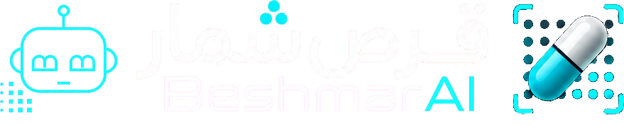
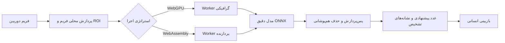

<p align="center">
  
</p>

<div align="center" dir="rtl">
  <h1>قرص شمار BeshmarAI — شمارش رایگان، خصوصی و روی دستگاه</h1>

  <p>
    یک برنامه دوزبانه و قابل نصب برای شمارش تصویری قرص؛<br />
    مناسب تیم‌های داروخانه، مراقبان، پژوهشگران و کاربرانی که به یک شمارش سریع و قابل بررسی نیاز دارند.
  </p>

  <p>
    <a href="https://beshmarai.ir/fa/"><strong>وب‌سایت فارسی</strong></a>
    ·
    <a href="https://beshmarai.ir/"><strong>English website</strong></a>
    ·
    <a href="https://beshmarai.ir/app/"><strong>ورود به برنامه</strong></a>
    ·
    <a href="README.md"><strong>English README</strong></a>
  </p>
</div>
<p align="center">
  

  
</p>

> **قرص شمار یک ابزار کمکی و قابل بازبینی است.** عدد پیشنهادی و نشانه‌های تشخیص باید توسط کاربر مسئول بررسی شوند. برنامه دارو را شناسایی نمی‌کند، دوز مصرف را تأیید نمی‌کند، نسخه نمی‌نویسد و جایگزین رویه‌های حرفه‌ای داروخانه نیست.

## معرفی پروژه

BeshmarAI یک سامانه دوربین‌محور برای شمارش قرص است که با یک اصل ساده طراحی شده است: تصویر شمارش تا حد ممکن باید روی دستگاه کاربر باقی بماند. نسخه عمومی به‌صورت وب‌سایت استاتیک و PWA ارائه می‌شود. مرورگر فایل‌های برنامه، ONNX Runtime و قطعه‌های تأییدشده مدل را دریافت می‌کند و inference را با WebGPU یا WebAssembly روی همان دستگاه انجام می‌دهد.

این مخزن، **نسخه عمومی و جداشده** پروژه است. وب‌سایت، برنامه دوزبانه، بسته مدل عمومی، انتخاب استراتژی اجرا و Workflow انتشار GitHub Pages در آن وجود دارد؛ اما Backend خصوصی، پایگاه داده، OTP، پرداخت، اشتراک، پنل مدیریت، Credentialهای پروداکشن و تاریخچه مخزن خصوصی در آن منتشر نشده‌اند.

## مزیت‌های اصلی

- **شمارش تصویری سریع** با دوربین موبایل یا دستگاه سازگار
- **نتیجه قابل بررسی** با نشانه‌های تشخیص روی تصویر
- **اجرای محلی مدل** بدون ارسال تصویر شمارش به سرور inference
- **بدون حساب کاربری**، شماره موبایل، OTP، پرداخت و اشتراک در نسخه عمومی
- **رابط دوزبانه** با انگلیسی پیش‌فرض و فارسی با یک لمس
- **انتخاب Auto، GPU یا CPU** از بخش تنظیمات
- **PWA قابل نصب** روی مرورگرهای پشتیبانی‌شده
- **استفاده مجدد از فایل‌های Cacheشده** در صورت اجازه مرورگر

## مسیرهای آنلاین

| بخش | نشانی | کاربرد |
|---|---|---|
| وب‌سایت فارسی | [beshmarai.ir/fa](https://beshmarai.ir/fa/) | معرفی، ایمنی، مقاله‌ها و صفحات پروژه |
| وب‌سایت انگلیسی | [beshmarai.ir](https://beshmarai.ir/) | نسخه اصلی انگلیسی سایت |
| برنامه شمارش | [beshmarai.ir/app](https://beshmarai.ir/app/) | دوربین، شمارش دقیق، تنظیمات و نصب PWA |
| مخزن عمومی | [BeshmarAI-Free](https://github.com/AliGhorbani1380/BeshmarAI-Free) | سورس قابل بررسی نسخه عمومی و Workflow انتشار |

## روش پیشنهادی شمارش

1. برنامه را با HTTPS باز و مجوز دوربین را صادر کنید.
2. قرص‌ها را زیر نور یکنواخت قرار دهید و تا حد امکان از هم جدا کنید.
3. محدوده شمارش را تنظیم کنید.
4. دکمه **شمارش دقیق** را بزنید.
5. تا پایان اجرای محلی مدل صبر کنید.
6. کادرها یا نشانه‌های تشخیص و عدد پیشنهادی را بررسی کنید.
7. در صورت هم‌پوشانی، بازتاب نور، تاری یا تشخیص ناقص، چیدمان را اصلاح و شمارش را تکرار کنید.
8. عدد نهایی را در فرآیند انسانی مسئولانه تأیید کنید.

## استراتژی اجرای هوش مصنوعی

| حالت | مناسب برای | رفتار |
|---|---|---|
| **خودکار — پیشنهادشده** | بیشتر کاربران | توان دستگاه را یک‌بار می‌سنجد و برنامه پایدار را ذخیره می‌کند |
| **GPU / WebGPU** | مرورگرها و GPUهای سازگار | از شتاب‌دهنده گرافیکی استفاده می‌کند و در صورت نیاز به CPU برمی‌گردد |
| **CPU / WebAssembly** | بیشترین سازگاری | در صورت پشتیبانی مرورگر با ۱، ۲ یا ۴ رشته اجرا می‌شود |

انتخاب GPU به معنی تضمین اجرای تمام عملیات روی GPU نیست. پایداری و صحت اجرای مدل بر اجبار یک Provider خاص اولویت دارند.

## بسته مدل عمومی

| مدل | کاربرد | اندازه | بسته‌بندی |
|---|---|---:|---|
| مدل Preview | راهنمای زنده و بازخورد سریع | ۲٬۶۷۴٬۹۰۸ بایت | یک قطعه تأییدشده |
| مدل دقیق | شمارش نهایی قابل بررسی | ۸۰٬۸۰۵٬۱۵۳ بایت | چهار قطعه تأییدشده |

در اولین آماده‌سازی شمارش دقیق ممکن است حدود ۸۰ مگابایت دانلود انجام شود. صفحه را تا پایان آماده‌سازی نبندید. در دفعات بعد، در صورت اجازه سیاست ذخیره‌سازی مرورگر، فایل‌های محلی دوباره استفاده می‌شوند.

## نتیجه ارزیابی مدل

اعداد زیر مربوط به ارزیابی پروژه روی مجموعه تست تمیز و کنارگذاشته‌شده هستند و تضمین عملکرد یکسان در همه دوربین‌ها، دستگاه‌ها و شرایط نوری نیستند.

| معیار | نتیجه |
|---|---:|
| تعداد تصاویر تست | ۱٬۴۸۲ |
| میانگین قدر مطلق خطا (MAE) | ۰٫۸۰۲۳ |
| دقت شمارش دقیق | ۸۰٫۰۹٪ |
| خطای حداکثر ±۱ قرص | ۸۹٫۹۵٪ |
| خطای حداکثر ±۲ قرص | ۹۳٫۳۲٪ |
| خطای حداکثر ±۵ قرص | ۹۶٫۲۹٪ |
| میانگین خطای علامت‌دار | ‎+۰٫۳۱۲۴ |

هم‌پوشانی قرص‌ها، خارج‌شدن بخشی از جسم از کادر، انعکاس، تاری، آلودگی لنز و ناسازگاری Runtime می‌توانند عملکرد واقعی را کاهش دهند.

## معماری



## فناوری‌های اصلی

| لایه | فناوری |
|---|---|
| وب‌سایت | Next.js 16، React 19 و خروجی استاتیک |
| برنامه PWA | React 19، Vite 8 و vite-plugin-pwa |
| زبان | TypeScript 6 |
| inference | ONNX Runtime Web 1.27 |
| شتاب‌دهی | WebGPU با بازگشت به WebAssembly |
| میزبانی | GitHub Pages با دامنه اختصاصی و HTTPS |
| خودکارسازی | GitHub Actions |

## ساختار مخزن

```text
.github/workflows/   Build و انتشار GitHub Pages
apps/site/           سایت انگلیسی با مسیرهای فارسی /fa
apps/web/            PWA دوزبانه شمارش قرص
apps/web/public/     دارایی‌ها، ONNX Runtime و قطعه‌های مدل عمومی
scripts/             بررسی مرز عمومی، صحت مدل و مونتاژ Deploy
docs/                تصاویر و دارایی‌های معرفی مخزن
SECURITY.md          راهنمای امنیت و گزارش مسئولانه
PRODUCTION_SOURCE.md منشأ رابط عمومی برگرفته از نسخه پروداکشن
```

## اجرای محلی

### پیش‌نیازها

- Node.js نسخه ۲۰٫۹ یا جدیدتر؛ نسخه ۲۲ LTS پیشنهاد می‌شود.
- npm سازگار با Lockfileها
- مرورگر مدرن
- HTTPS یا localhost برای دوربین و قابلیت‌های پیشرفته مرورگر

### نصب

```bash
npm ci --prefix apps/site
npm ci --prefix apps/web
```

### اجرای سایت

```bash
npm run dev --prefix apps/site
```

### اجرای برنامه

```bash
npm run dev --prefix apps/web
```

### اعتبارسنجی کامل

```bash
npm run typecheck
npm run verify:public
npm run verify:models
npm run build
```

خروجی نهایی یک درخت استاتیک واحد می‌سازد:

```text
/        سایت انگلیسی
/fa/     سایت فارسی
/app/    برنامه دوزبانه شمارش قرص
```

## مرز امنیتی نسخه عمومی

نسخه عمومی عمداً شامل این موارد نیست:

- Backend و پایگاه داده خصوصی
- ورود شماره موبایل و OTP
- پرداخت، اشتراک و پنل‌های مدیریت
- Credentialهای پروداکشن و فایل واقعی `.env`
- Endpoint خصوصی ارسال تصویر یا Telemetry
- تاریخچه Git مخزن خصوصی

## نکات مرورگر و دستگاه

- دسترسی دوربین معمولاً به HTTPS یا localhost نیاز دارد.
- پشتیبانی WebGPU بین مرورگرها، سیستم‌عامل‌ها، Driverها و دستگاه‌ها متفاوت است.
- CPU/WebAssembly مسیر سازگار در صورت نبود یا ناپایداری GPU است.
- WebAssembly چندرشته‌ای ممکن است به Cross-Origin Isolation نیاز داشته باشد.
- محدودیت‌های iPhone و iPad می‌توانند با دسکتاپ متفاوت باشند.
- مرور خصوصی یا پاک‌سازی Storage ممکن است باعث دانلود دوباره مدل شود.

## هشدار ایمنی

- هر عدد باید توسط انسان بررسی شود.
- از برنامه برای شناسایی نوع دارو استفاده نکنید.
- از خروجی برای تعیین دوز، اعتبار نسخه یا مناسب‌بودن درمان استفاده نکنید.
- اگر کادرها ناقص یا تکراری‌اند، شمارش را تکرار کنید.
- قوانین، SOP و مسئولیت حرفه‌ای محیط خود را رعایت کنید.
- برای گزارش خطا، مدل دستگاه، سیستم‌عامل، مرورگر، نسخه مرورگر، حالت اجرا و متن دقیق خطا را ارسال کنید.

## سازنده و راه‌های ارتباطی

**سازنده و نگهدارنده پروژه:** [علی قربانی بارگانی](https://github.com/AliGhorbani1380)

| راه ارتباطی | مشخصات |
|---|---|
| ایمیل پشتیبانی | [support@beshmarai.ir](mailto:support@beshmarai.ir) |
| تلفن پشتیبانی | [‎+98 921 331 4813](tel:+989213314813) |
| پروفایل GitHub | [github.com/AliGhorbani1380](https://github.com/AliGhorbani1380) |
| LinkedIn | [Ali Ghorbani](https://www.linkedin.com/in/ali-ghorbani-66b57a278/) |
| وب‌سایت | [beshmarai.ir](https://beshmarai.ir/) |
| مخزن عمومی | [BeshmarAI-Free](https://github.com/AliGhorbani1380/BeshmarAI-Free) |

در پیام پشتیبانی، اطلاعات محرمانه بیمار یا نسخه را ارسال نکنید.

## حقوق استفاده

عمومی‌بودن مخزن به‌تنهایی مجوز استفاده، تغییر، فروش، واگذاری مجوز یا بازتوزیع ایجاد نمی‌کند. تا زمانی که فایل مجوز جداگانه‌ای خلاف آن را مشخص نکرده باشد، همه حقوق محفوظ است.

---

<div align="center" dir="rtl">
  <strong>BeshmarAI — با اطمینان بشمارید و هر نتیجه را بررسی کنید.</strong><br />
  <sub>تصویر شما، دستگاه شما، کنترل شما.</sub>
</div>
