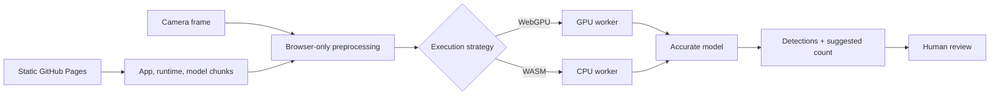

<div align="center">
  

  <h1>Free, Private, On‑Device AI Pill Counting</h1>

  <p>
    A bilingual pill-counting PWA for pharmacy teams.<br />
    Images stay on the device. No account, OTP, subscription, or image-upload backend.
  </p>

  <p>
    <a href="https://beshmarai.ir"><strong>Website</strong></a>
    ·
    <a href="https://beshmarai.ir/app/"><strong>Open the App</strong></a>
    ·
    <a href="README.fa.md"><strong>فارسی</strong></a>
  </p>

  <p>
    
    
    
    
    
  </p>
</div>

<p align="center">
  

  
</p>

## What makes the public edition different

BeshmarAI Free is not a thin demo that sends camera frames to a server. The public application, ONNX Runtime assets, and chunked model files are delivered statically and executed inside the browser.

- **English by default, Persian one tap away** — the website uses `/` for English and `/fa/` for Persian; the app remembers its own language selection.
- **Automatic, GPU, or CPU execution** — automatic mode profiles the device once; advanced users can prefer WebGPU or CPU/WebAssembly and select CPU threads.
- **Reviewable accurate count** — the final count is presented with detection markers so the user can inspect the result.
- **Privacy by architecture** — no account, phone login, OTP, subscription, private inference API, or image-upload endpoint.
- **Installable PWA** — application assets and model chunks are cached for faster repeat use and supported offline workflows.
- **Safe fallback** — WebGPU can fall back to a stable CPU path when the browser or device is incompatible.

## Product preview

<table>
  <tr>
    <td width="50%"></td>
    <td width="50%"></td>
  </tr>
  <tr>
    <td align="center"><strong>Focused pharmacy workflow</strong></td>
    <td align="center"><strong>On-device model execution</strong></td>
  </tr>
</table>

## Execution strategy

The application persists a device-specific strategy and exposes a user preference in **Settings**:

| Mode | Intended use | Behavior |
|---|---|---|
| **Automatic** | Recommended | Profiles the device and reuses the best stable plan |
| **GPU / WebGPU** | Compatible modern devices | Uses WebGPU with a safe CPU fallback |
| **CPU / WebAssembly** | Maximum compatibility | Uses 1, 2, or 4 threads where supported |

The public model is split into GitHub-friendly chunks and verified against a manifest before use.

## Architecture



## Repository layout

```text
apps/site   English-first Next.js static website with /fa Persian routes
apps/web    Vite + React bilingual pill-counting PWA
scripts     Public-boundary, model-package, and Pages build verification
```

## Build locally

Requirements: Node.js 22+ and npm.

```bash
npm ci --prefix apps/site
npm ci --prefix apps/web
npm run typecheck
npm run build
```

The root build assembles a single static deployment tree containing the website at `/` and the PWA at `/app/`.

## Security and privacy boundary

The public repository intentionally excludes:

- private backend and database code
- mobile-number login and OTP services
- payment, subscription, and administration systems
- production credentials and real `.env` files
- private telemetry endpoints
- private Git history

See [`SECURITY.md`](SECURITY.md) and [`PRODUCTION_SOURCE.md`](PRODUCTION_SOURCE.md).

## Safety

BeshmarAI is an **assistive counting tool**. Computer vision can be affected by overlap, lighting, focus, reflections, camera hardware, browser behavior, and device performance. Every result must be reviewed and confirmed by the responsible user. It does not identify medicine, prescribe treatment, verify dosage, or replace professional procedures.

## Languages

- [English README](README.md)
- [راهنمای فارسی](README.fa.md)
- [English website](https://beshmarai.ir/)
- [وب‌سایت فارسی](https://beshmarai.ir/fa/)

## Rights

Public visibility does not by itself grant permission to use, sell, modify, or redistribute the project. Unless a separate license file is added, all rights are reserved.
